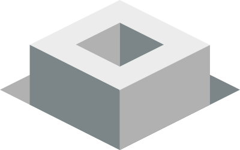

# Groundwork

[![Issue Count][issue-badge]][issue-url] [![Dependency Status][dep-badge]][dep-url] [![Build status][build-badge]][build-url]

### Metalsmith blog template. It rocks.



Simple [static site](https://www.staticgen.com/) blog template built with [Metalsmith](http://www.metalsmith.io/), for web designers that code.

Promoting [IndieWeb](https://indieweb.org/) principles of [Publish (on your) Own Site, Syndicate Elsewhere](https://indieweb.org/POSSE).

## Installation

Make sure to have [Git](https://git-scm.com/) and [Node.js](https://nodejs.org/en/) installed.

```
$ git clone git@github.com:growdigital/groundwork
$ cd groundwork
$ npm install
$ npm run dev
```

## Documentation

1. Make it your own: enter your details in `package.json` and `index.js`
2. Change your CSS settings `/src/assets/css/settings/`
3. Modify/create templates in `/layouts/` and `/partials/`
4. Add new modules in `/src/components/` (discrete components) and `/src/objects/` (design patterns).
5. Get rid of legacy CSS in `/src/assets/css/shame.css`
6. Create new posts in `/src/posts/`
7. Push to your git repo eg on [GitHub](https://github.com/)
8. Publish to the platform of your choice eg [Netlify](https://www.netlify.com), [Now](https://zeit.co/now), [Surge](https://surge.sh/)…

More in-depth documentation: [www.groundwork.rocks](https://www.groundwork.rocks/)

Issues and features in the [Groundwork Roadmap](https://github.com/growdigital/groundwork/projects/1) 😍

## Contact

* Jake Rayson [contact@growdigital.org](contact@growdigital.org) [@growdigital](https://twitter.com/growdigital)
* Twitter [@GroundworkRocks](https://twitter.com/GroundworkRocks)

[](https://www.netlify.com)

[issue-badge]: https://codeclimate.com/github/growdigital/groundwork/badges/issue_count.svg
[issue-url]: https://codeclimate.com/github/growdigital/groundwork/issues
[dep-badge]: https://www.versioneye.com/user/projects/599ca850368b08141959f90f/badge.svg?style=flat-square
[dep-url]: https://www.versioneye.com/user/projects/58d97d9226a5bb002b54bea2
[build-badge]: https://travis-ci.org/growdigital/groundwork.svg?branch=master
[build-url]: https://travis-ci.org/growdigital/groundwork
